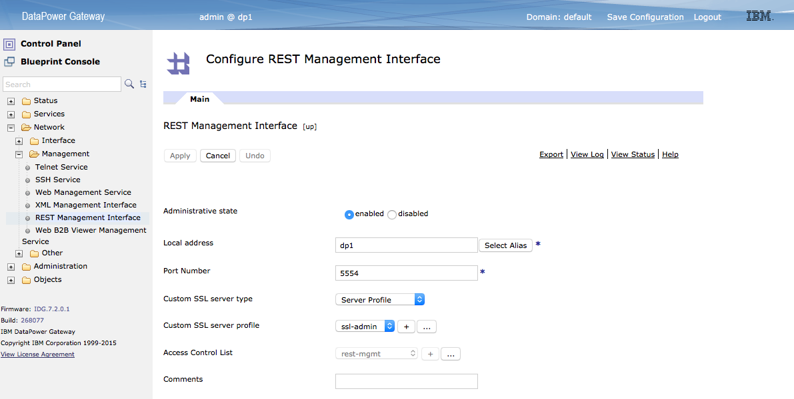
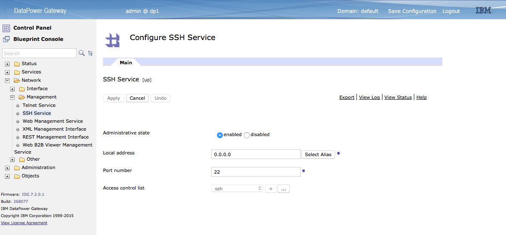
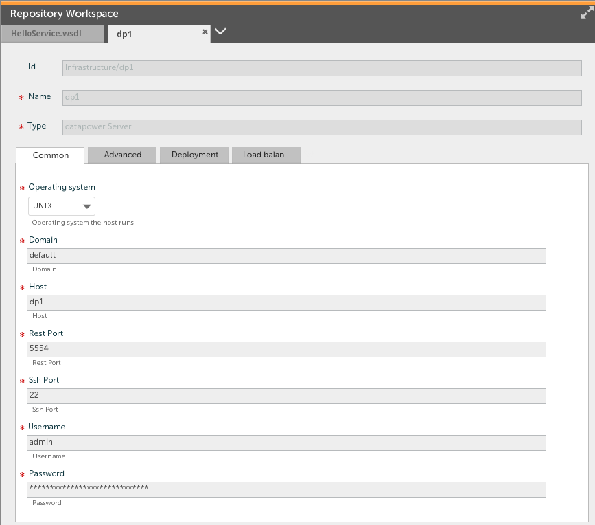
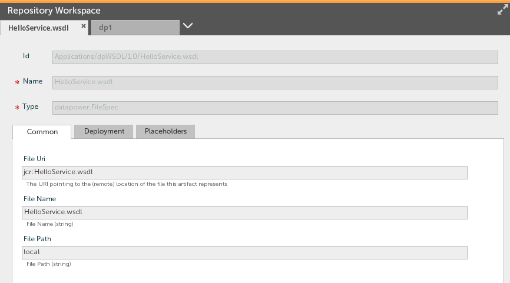
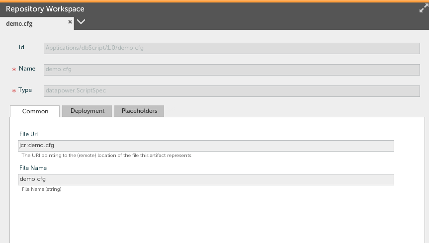

# Build status #

# Datapower plugin #
This plugin allows XL Deploy to configure applications in an IBM Data Power device.

# Overview #

# Requirements #

##Contifuring DataPower##
The DataPower devices needs to have a firware version greater that 7.0.0 and the correct management interfaces enabled.  To work with this plugin the REST Management interface needs to be enabled as follows:

To execute scripts on your Datapower device from XL Deploy you will also need to enable the SSH Management Interface as follows:

# Installation #

Place the plugin JAR file into your `SERVER_HOME/plugins` directory. 

# Features #

##Datapower Infrastructure Container##
The datapower plugin will allow you to create a Datapoer Server for each domain on your datapower device.  The *datapower.Server* properties include the following:

* **Operating System**: This is the operating system you XL Deploy server is running
* **Domain**: The Datapower domain that this *datapower.Server* represents
* **Host**: The DNS name of your Datapower management interface
* **REST Port**: The port of the Datapower REST Management server
* **SSH Port**: The port of the Datapower SSH Service
* **Username**: The username that will be used to connec to the Datapower appliance
* **Password**: The password that will be used to connec to the Datapower appliance

##Datapower Deployables##

###datapower.FileSpec###

The *datapower.FileSpec* is a deployable file to a datapower device.  The example below shows a WSDL as a *datapower.FileSpec*.

###datapower.ScriptSpec###

The *datapower.ScriptSpec* is a deployable script file that will be run on the datapower device.  By default the scipt is uploaded to the *temporary* space.  Once the script is executed the script is deleated.

##References##

* [DataPower XML Integration Appliance XI50](ftp://ftp.software.ibm.com/software/integration/datapower/library/prod_docs/4Q2008/XI-3.7.2-CommandReference.pdf)

